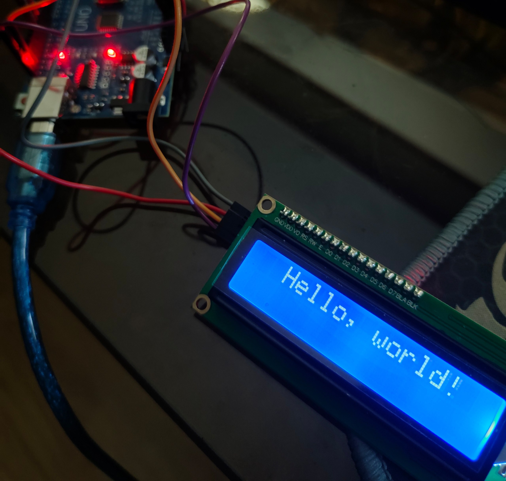
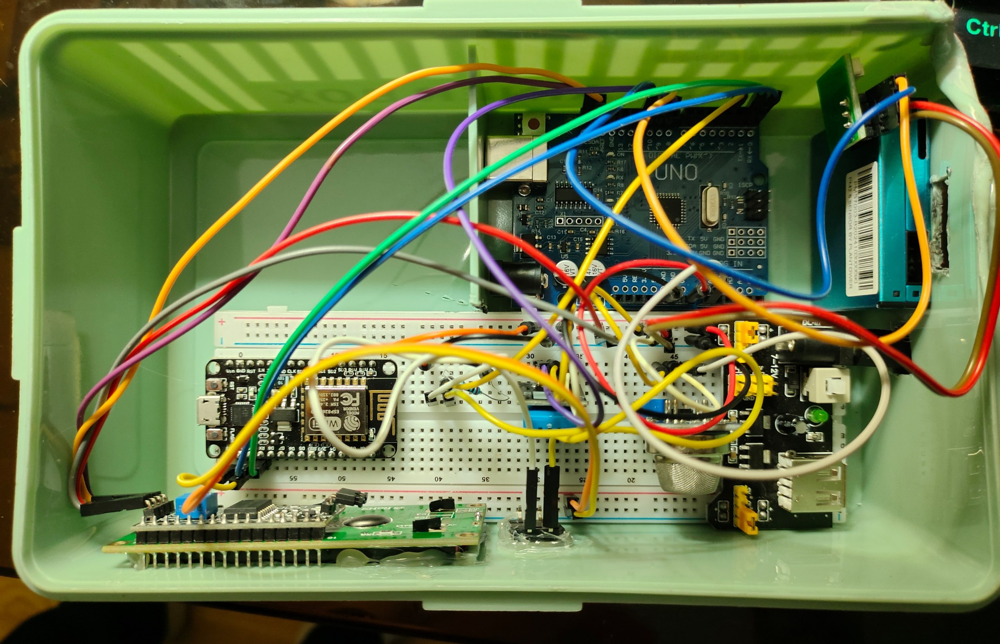

This blog post tells a story of mine about my introduction to the world of embedded programming.
I will share what brought me joy and fun while doing so. Perhaps you can get inspired too.

---

If you are in the field of computer science, you may have heard about Arduino and other microcontrollers.
They could appear in your feed on social media, and you thought to yourself that one day you would try it.
This happened to me, and I had been postponing trying it for some reason.
That was until my last year at the university started, because I was offered to pick a module called “Internet of Things” which I decided to pick.

My first euphoria came in the first class of the module. It was blinking an LED. This is considered a “Hello world” in the world of embedded programming,
and it gives you the same vibe of novelty and pure curiosity.

I started with Arduino Uno and was writing code using C++. Since I had some experience with it and also with [Rust](https://rust-lang.org/), it was not hard to deal with.


### Framework agnostic
Day after day, we were trying different input and output devices like LCD screens, buttons, light, or motion sensors. It was fun.

I loved how easy it was to “talk” devices together. Just apply the right voltage and current and follow certain rules (protocols),
and here we go - two different devices from different manufacturers communicate with each other.
You can use physics as a programming language, and it does not limit you.
It does not have any alternatives, thus no programming wars.
As a joke, I like to call it “truly framework agnostic”.



### No Async / await ?
I got my second euphoria when I managed to deal with multitasking on a single thread by my own. 
Arduino has one worker thread for code execution, and it is the developer's responsibility to deal with multitasking.
So if you need to do several tasks like handling button presses, updating the screen, receiving bytes from sensors in a seemingly parallel manner, you need to figure out how to write non-blocking code.

This is a huge topic to explore, and I strongly recommend that everyone try to write their own tiny solutions for the problem.
In my case, I just used one of the most common approaches - cooperative multitasking using `millis()`. I wrote my own tiny scheduler to make it easier to work with.

```c++
#include "Scheduler.h"
#include <Arduino.h>
#include "config.h"

Scheduler::Scheduler() {
  _tasks = nullptr;
}

Scheduler::~Scheduler() {
  delete[] _tasks;
}

void Scheduler::begin(Task* tasks, uint8_t numberOfTasks) {
  _numberOfTasks = numberOfTasks;
  _tasks = new Task[_numberOfTasks];

  for (uint8_t i = 0; i < _numberOfTasks; i++) {
    _tasks[i] = tasks[i];
  }

#if DEBUG_MODE
  Serial.println("\n[Scheduler] tasks started!");
#endif
}

void Scheduler::run() {
  _now = millis();
  
  for (uint8_t i = 0; i < _numberOfTasks; i++) {
    // skip if null
    if (_tasks[i].callback == nullptr) {
      continue;
    }

    // run if it is time
    if ((_now - _tasks[i].lastCalledTime) >= _tasks[i].interval) {
      _tasks[i].lastCalledTime = _now;
      _tasks[i].callback();
    }
  }
}
```

So it can be used like this
```c++
Task tasks[] = {
  // { callbackFn, interval time, delay time from start }
  { updatePms, 100, 0 },
  { managePowerPms, 5000, 0 },
  { reportToEsp, 60000, 0 }
};

scheduler.begin(tasks, sizeof(tasks) / sizeof(tasks[0]));
```

Basically, you just run different functions with different intervals and inside them deal with inter-task communication just using memory addresses or variables.
It was intentionally limited and simple. This inspired me to try writing more complex mechanisms in the future and explore how, for example, [libuv](https://libuv.org/) handles it.

---

So, I think that was all I wanted to share with the world. I hope you liked it. You can check out my [air quality monitoring project](https://github.com/mmnvb/air) I've made as coursework.

It was Bobomurod. Take care. Good bye.